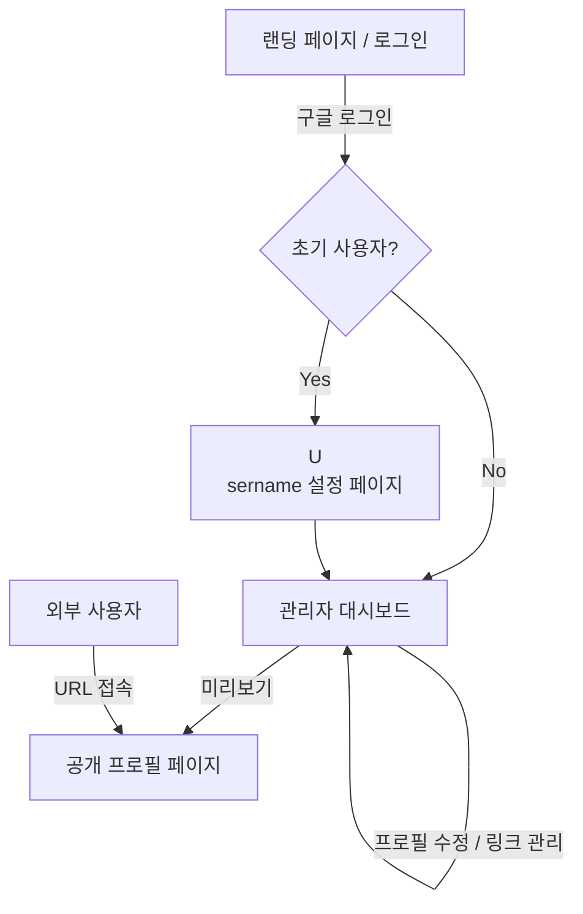
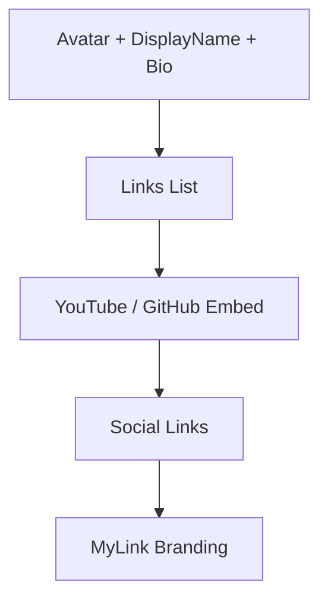

# 마이링크 (MyLink) 와이어프레임

이 문서는 마이링크 서비스의 구조와 주요 페이지의 레이아웃을 정의합니다.

## 1. 서비스 플로우 (Service Flow)



---

## 2. 주요 페이지 와이어프레임

### 2.1 랜딩 페이지 (Landing Page)
서비스의 가치 제안과 로그인을 유도하는 첫 화면입니다.

**ASCII Art 스타일:**
```text
+-------------------------------------------------------------+
|  [MyLink Logo]                                [Login Button]  |
+-------------------------------------------------------------+
|                                                             |
|             "나만의 모든 링크를 한 곳에 담으세요"              |
|                                                             |
|    [  Your Custom URL  ]     [  Claim Now  ]                |
|                                                             |
|         +-----------------------------------------+         |
|         |           [ Google Login Button ]       |         |
|         +-----------------------------------------+         |
|                                                             |
|   [ Feature 1 ]        [ Feature 2 ]        [ Feature 3 ]   |
|   Easy Customizing    Rich Media Embed     QR Code Share    |
|                                                             |
+-------------------------------------------------------------+
```

---

### 2.2 관리자 대시보드 (Admin Dashboard)
링크를 추가, 수정, 정렬하고 프로필 정보를 실시간으로 반영하는 핵심 공간입니다.

**Mermaid Layout Diagram:**
```mermaid
graph TD
    subgraph Admin_Dashboard
        Top[Top Navigation: Links | Appearance | Analytics | Settings]
        Left[Link Management Area]
        Right[Mobile Preview Area]
    end
    Left --> AddLink[+ Add New Link]
    Left --> LinkList[Link Item: DragHandle | Favicon | Text Edit | Toggle]
    Right --> Mockup[iPhone Mockup: Live Preview]
```

**ASCII Art 스타일:**
```text
+--------------------------------------------------------------------------+
| [MyLink]   [Links]  [Appearance]  [Settings]            [Share] [Avatar] |
+--------------------------------------------------------------------------+
|                                     |                                    |
|  [ + Add New Link ]                 |        +------------------+        |
|                                     |        |   [ Preview ]    |        |
|  +-------------------------------+  |        |                  |        |
|  | [::] [F] [ Title ] (Edit)     |  |        |    (o) Avatar    |        |
|  |      [ URL       ] (Edit)     |  |        |      Name        |        |
|  | [Toggle] [Hilight] [Delete]   |  |        |      Bio         |        |
|  +-------------------------------+  |        |                  |        |
|                                     |        |  [   Link 1   ]  |        |
|  +-------------------------------+  |        |  [   Link 2   ]  |        |
|  | [::] [F] [ Title ] (Edit)     |  |        |  [   Link 3   ]  |        |
|  |      [ URL       ] (Edit)     |  |        |                  |        |
|  | [Toggle] [Hilight] [Delete]   |  |        |   [QR Code]      |        |
|  +-------------------------------+  |        +------------------+        |
|                                     |          Mobile Preview            |
+--------------------------------------------------------------------------+
```

---

### 2.3 공개 프로필 페이지 (Public Profile Page)
최종 방문자에게 보여지는 반응형 링크 트리 페이지입니다.

**Mermaid Layout Diagram:**


**ASCII Art 스타일:**
```text
+-------------------------------------------+
|                                           |
|                  ( @ )                    |
|                Photo Box                  |
|                                           |
|               DisplayName                 |
|             "Welcome to my Bio"           |
|                                           |
|       +---------------------------+       |
|       | [F]     Link Title      | |       |Highlight
|       +---------------------------+       |
|                                           |
|       +---------------------------+       |
|       | [F]     Link Title      | |       |
|       +---------------------------+       |
|                                           |
|       +---------------------------+       |
|       |      [ YouTube Video ]     |      |Rich Media
|       |      [      Embed    ]     |      |
|       +---------------------------+       |
|                                           |
|          [IG]  [TW]  [YT]  [GH]           |
|                                           |
|               [ MyLink Logo ]             |
+-------------------------------------------+
```

---

### 2.4 QR 코드 생성 및 공유 레이어 (QR Code Modal)
언제든지 접근 가능한 프로필 공유용 레이아웃입니다.

**ASCII Art 스타일:**
```text
+---------------------------------------+
|                                     X |
|          [ My Profile QR ]            |
|                                       |
|         +-------------------+         |
|         |                   |         |
|         |      #######      |         |
|         |      #######      |         |
|         |      #######      |         |
|         |                   |         |
|         +-------------------+         |
|                                       |
|    [ Download QR ]   [ Copy Link ]    |
|                                       |
+---------------------------------------+
```
